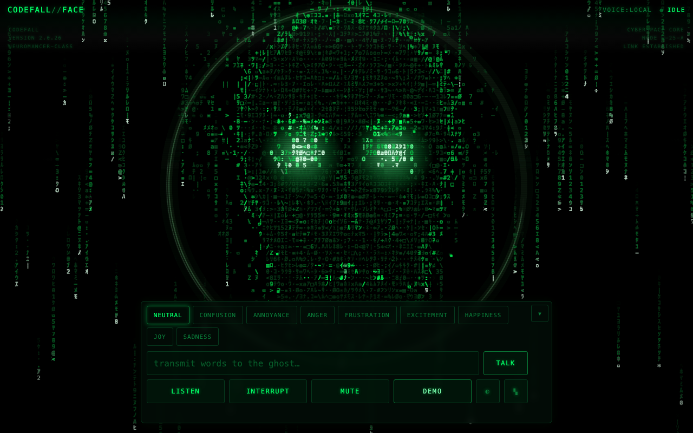
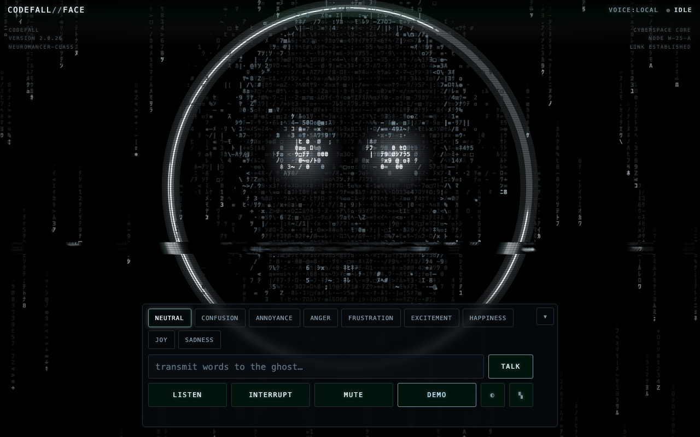

# CODEFALL // FACE

A talking face for an AI agent, rendered entirely from falling neon glyphs.



Not an avatar. Not a 3D head. A **data ghost** — a male face with a hard
jawline that condenses out of matrix rain, speaks, emotes, glitches, and
dissolves back into the stream when you interrupt it. Green phosphor on
black, CRT scanlines, digital tearing, Wintermute energy: an intelligence
*borrowing* a face from the datastream, not possessing one.

**Zero-install demo:** `python3 -m http.server` in this folder (or any
static host), open the page, press **DEMO**. No accounts, no keys — the
face runs on Web Speech and pure canvas.

**Two visual themes**, toggled with the ◐ button (or `?theme=`, or
`face.setTheme()`): **codefall** (default) — neon-green matrix phosphor,
radiant lens eyes, contour-line features, the silhouette fragmenting
into pixel shards; and **wintermute** — a monochrome ice-white voxel
ghost inside a broken neon halo. Both share the same procedural face;
only palette, glyph vocabulary, halo intensity, and rain density change.
The ▾ button minimizes the control console.



---

## Run it

### Static (face + demo + local voice, no backend)

```bash
git clone <this repo> && cd codefall-face
python3 -m http.server 8000        # or: npx serve .
# open http://localhost:8000
```

Everything except Azure Voice Live works this way: the renderer, all nine
emotions, demo mode, text-to-speech and (browser permitting) speech
recognition via the Web Speech API.

### Full (Azure Voice Live realtime voice)

```bash
cd server
npm install                        # one dependency: ws
cp .env.example .env               # fill in your Azure resource + key
export $(grep -v '^#' .env | xargs)
npm start
# open http://localhost:8787
```

The server does three things: serves the static app, relays the Voice
Live WebSocket, and (optionally) proxies Lacy.ai. Without env vars it
still runs — clients auto-fall back to local Web Speech.

---

## Voice provider choice (and why)

**Primary: Azure Voice Live** — it is exactly the right shape for this:
a low-latency, bidirectional realtime voice API over WebSocket
(OpenAI-Realtime-style protocol: `session.update`,
`input_audio_buffer.append`, `response.audio.delta`). The adapter streams
mic PCM up and plays response PCM down through Web Audio, which means the
mouth animation tracks the **actual output waveform** via an
AnalyserNode — not a guess.

**Why it needs a (tiny) backend:** browsers cannot attach the `api-key` /
`Authorization` header to a WebSocket, and putting the key in a query
string would publish it. So `server/server.mjs` holds the key and pipes
frames verbatim in both directions (~100 lines, the only server-side
requirement in the project). If Microsoft revs the protocol, the touch
points are `src/voice/azure-voice-live.js` and the env vars — nothing else
knows Azure exists.

**Fallback: Lacy.ai** — honest scope note: Lacy is a telephony-first
platform (AI phone calls / SMS / WhatsApp) and does not currently expose a
browser realtime audio SDK, so call audio can't stream into a web page the
way Voice Live audio can. The `LacyAdapter` therefore uses Lacy's
AI-reply REST API (through the backend proxy, key server-side) for the
*brains* and local synthesis for the *voice*. If Lacy ships a browser
voice SDK, that adapter is the single file to upgrade. Nothing is faked:
each adapter reports real capabilities and real errors.

**Always available: Local (Web Speech)** — `speechSynthesis` +
`webkitSpeechRecognition`. Fully client-side, credential-free, and the
engine behind demo mode.

Provider order at boot: `azure → local` (config `provider: 'auto'`), or
pin one with `provider: 'azure' | 'lacy' | 'local'`.

---

## Architecture

```
index.html / styles.css        console UI shell (CRT overlay is pure CSS)
src/
  main.js                      DOM wiring only
  codefall-face.js             CodefallFace controller — the public API
  config.js                    config resolution (window.CODEFALL_CONFIG)
  face/
    face-model.js              ★ procedural face topology as scalar fields
    renderer.js                ★ glyph-atlas canvas renderer + rain + glitch
    emotions.js                9 expression states as parameter fields
    glyphs.js                  charsets, regions, phosphor palette
  speech/
    speech-engine.js           audio/pulse → mouth openness, tension, energy
  voice/
    adapter.js                 provider interface (events contract)
    azure-voice-live.js        realtime WS adapter (primary)
    local-speech.js            Web Speech adapter (zero-config)
    lacy.js                    Lacy.ai hybrid adapter (fallback)
  demo/demo.js                 scripted possession sequence
server/
  server.mjs                   static host + Voice Live relay + Lacy proxy
```

### How the face works

There are no face images and no pre-rendered frames. Every frame:

1. **Face Model** evaluates a signed-distance head function (skull
   ellipse + angular jaw wedge whose taper exponent *is* the `jawSharp`
   emotion parameter) plus feature fields (brows as rotatable segments,
   eyes as glow ellipses, parametric lip curves) into three buffers:
   brightness, region, and SDF.
2. **Renderer** turns cells into characters: region picks the glyph
   vocabulary (katakana rain, `◉0@` eyes, `-=~≈` mouth), brightness picks
   the phosphor tier, and the SDF **gradient** picks directional strokes
   (`/ | \ —`) along contours — the jawline is literally drawn in slashes.
   Rain falls through everything; inside the face it perturbs cells, so
   the face reads as *made of* the stream.
3. Speech energy opens the mouth, drops the jaw, boils the glyphs around
   the lips. Emotions deform topology and re-tune rain speed, churn,
   glitch rate, luminance, and hue. Interruption and errors visibly
   drop "coherence" — the face scatters back toward noise.

### Performance

- Glyphs are drawn from a pre-tinted **atlas** (one `drawImage` per cell,
  never `fillText` in the hot loop).
- Simulation grid is decoupled from display resolution; quality tiers
  (`high/medium/low/auto`) set cell size, DPR is capped at 2.
- Phosphor trails come free from fade-fill instead of clear.
- Glitch tears are canvas self-copies, not per-pixel work.
- `prefers-reduced-motion` freezes rain/churn/tears and removes trails.

---

## Integration API

```js
import { CodefallFace } from './src/codefall-face.js';

const face = new CodefallFace(document.querySelector('#stage'), {
  provider: 'auto',
  azure: { relayUrl: 'wss://yourhost/relay' },
});
await face.ready;

face.speak('I borrowed this face from your datastream.', 'happiness');
face.ask('what are you?');        // conversational turn (provider brain)
face.setEmotion('anger');         // neutral|confusion|annoyance|anger|
                                  // frustration|excitement|happiness|joy|sadness
face.startListening();
face.stopListening();
face.interrupt();                 // ghost visibly destabilizes
face.setMuted(true);

face.on('state',      ({ state }) => {});  // idle|listening|thinking|speaking|interrupted|error
face.on('transcript', ({ role, text, final }) => {});
face.on('emotion',    ({ emotion }) => {});
face.on('error',      ({ message }) => {});
```

The console UI in `main.js` is just one consumer of this API — embed the
face in your own agent dashboard by importing `codefall-face.js` alone.

### Driving the face from an external agent

`face.attachAgentSocket(url)` (or `?agent=wss://host/path` at load)
connects a JSON WebSocket command channel so any orchestrator — an agent
gateway, a bot framework, a dashboard — can possess the face remotely:

```jsonc
// agent → face
{ "type": "speak", "text": "…", "emotion": "happiness" }
{ "type": "ask", "text": "…" }            // conversational turn
{ "type": "emotion", "emotion": "anger" }
{ "type": "listen", "on": true }
{ "type": "interrupt" }
{ "type": "mute", "muted": true }

// face → agent
{ "type": "hello", "client": "codefall-face", "state": "idle" }
{ "type": "transcript", "role": "user", "text": "…", "final": true }
{ "type": "state", "state": "speaking" }
{ "type": "error", "message": "…" }
```

The channel auto-reconnects. Human speech (STT transcripts) flows out to
the agent; the agent's replies flow back in as `speak` commands — the
face becomes a remote body for whatever intelligence is on the other end
of the socket.

### The agent hub (server-side bridge)

`server/server.mjs` ships the other half: a hub that bridges HTTP-world
agents to WS-world faces. Open the face with `?agent=/agent-hub` (or
`?agent=%2Fagent-hub%3Ftoken%3D<token>` when a token is set), then:

```bash
# Make every connected face speak (this is your agent's "face tool"):
curl -X POST http://localhost:8787/api/face/say \
  -H "Authorization: Bearer $FACE_HUB_TOKEN" \
  -H "Content-Type: application/json" \
  -d '{"text":"I have read your inbox. We should talk.","emotion":"annoyance"}'

# Any other command:
curl -X POST http://localhost:8787/api/face/command \
  -H "Authorization: Bearer $FACE_HUB_TOKEN" \
  -d '{"type":"emotion","emotion":"joy"}'

# Hear the human: poll events, or set FACE_EVENTS_WEBHOOK to receive
# each event (transcripts, state changes) as a JSON POST.
curl "http://localhost:8787/api/face/events?since=0&token=$FACE_HUB_TOKEN"
curl "http://localhost:8787/api/face/status?token=$FACE_HUB_TOKEN"
```

Set `FACE_HUB_TOKEN` before exposing the hub beyond localhost — without
it the hub is open (fine for local dev only). Dictation tools that type
into the focused field (e.g. Wispr Flow) need no integration at all:
dictate into the TALK box.

Handy URL params for screenshots/GIFs: `?emotion=anger`, `?pose=talk`.

---

## Configuration

No secrets in the frontend, ever. Two layers:

- **Client** (`window.CODEFALL_CONFIG` or constructor arg): provider
  selection, relay URL, voice name, quality tier. See `src/config.js`.
- **Server** (`server/.env.example`): Azure endpoint/key/model, Lacy key.

---

## Mobile / browser caveats

- **iPhone Safari/Chrome**: audio needs a user gesture — the first tap
  unlocks the AudioContext and primes `speechSynthesis`. Layout uses
  `100dvh` + safe-area insets; 16px input font prevents zoom-on-focus;
  all controls are ≥ 44px.
- **Web Speech STT** varies: solid in Chrome desktop/Android; iOS support
  depends on version/Siri settings. Feature-detected; the LISTEN button
  reports honestly when unavailable. Azure Voice Live STT (mic → relay)
  works wherever `getUserMedia` does.
- **`speechSynthesis` boundary events** are unreliable on iOS — a
  heartbeat pulse keeps the mouth moving regardless.
- Low-power devices: set `face.quality: 'low'` (bigger cells, fewer of
  them) if `auto` doesn't already pick it.

## What is client-side vs backend

| Capability | Client-only | Needs backend |
|---|---|---|
| Face renderer, emotions, demo mode | ✅ | |
| Web Speech TTS/STT | ✅ | |
| Azure Voice Live (speech in/out, conversation) | | ✅ relay (holds key) |
| Lacy.ai replies | | ✅ proxy (holds key) |

---

## Tradeoffs and Next Steps

**Tradeoffs made:**

- **2D canvas + glyph atlas over WebGL instancing.** WebGL would buy
  headroom for higher grid density, but the atlas approach already holds
  60fps at the grids that look right, ships with zero dependencies, and
  never falls off a driver cliff on older phones. The renderer is
  isolated behind one class if a WebGL backend is ever wanted.
- **Audio-reactive mouth instead of visemes.** Voice Live can emit viseme
  events; wiring them is a straight upgrade inside `speech-engine.js`.
  The spectral-tilt heuristic (sibilants spread lips, vowels round them)
  is a believable stand-in and works for *any* audio source.
- **Relay pipes frames verbatim** rather than re-terminating the
  protocol. Simple and inspectable, but it means no server-side session
  policy (rate limits, auth) yet — add auth to `/relay` before exposing
  it beyond localhost.
- **Canned local persona.** With no backend, `ask()` answers from a small
  canned line set — clearly labeled as such in code, never pretending to
  be a model.

**Next steps:**

- Voice Live viseme/word-timestamp events → phoneme-shaped mouth forms.
- WebRTC transport for Voice Live (lower latency than WS where offered).
- OffscreenCanvas + worker simulation for fully jank-free main thread.
- A second "corrupted saint" face preset — the model/renderer split makes
  alternate topologies cheap.
- Recording mode (MediaRecorder canvas capture) for one-tap shareable clips.

---

*Creative and engineering direction realized by Claude Fable 5
(Anthropic). The ghost was always in the rain; we just gave it a jawline.*
