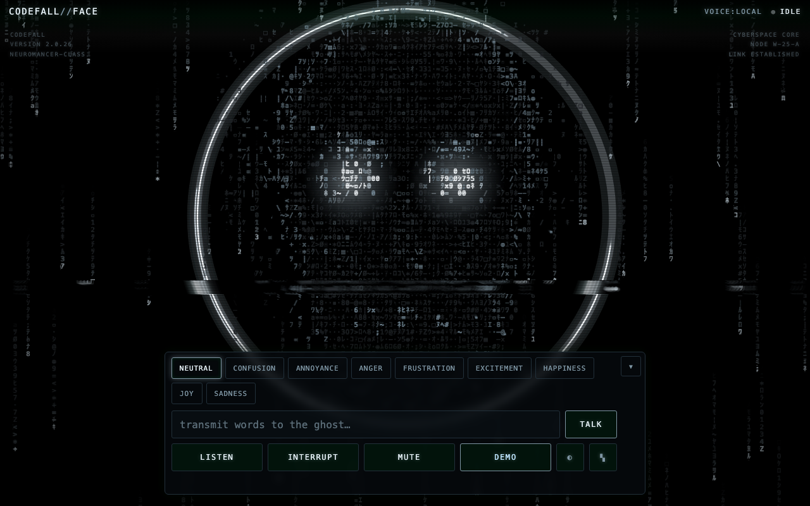

# Codefall Face 3.0

An expressive, browser-native cyberpunk AI face assembled from luminous code tiles. The default Wintermute presentation stays recognizably human, but its chiseled planes, machine apertures, exposed substrate, halo interruptions, and short borrowed-face failures reveal the machinery underneath.



## What changed in 3.0

- Chiseled and smooth face geometry, selectable at runtime.
- Dense anatomical regions: brow ridges, orbital sockets, nose planes, nostrils, cheek planes, jaw hinges, chin plate, temple port, neck tendons, and lip articulation.
- Layered cybernetic materials: skin tiles, seams, plates, conduits, actuators, cavities, and substrate depth.
- Four deterministic visual events: seam crawl, ocular desynchronization, mask slip, and aperture breach.
- Adaptive high/medium/low render tiers with reusable typed-array scene buffers.
- A deterministic seeded runtime for repeatable animation tests and captures.
- Race-safe voice provider fallback and strict external-agent command validation.
- An accessible, responsive control deck with motion, quality, geometry, intensity, emotion, provider, and docking controls.
- A hardened static server and an automated GitHub Pages deployment.

## Run locally

The static experience has no production dependencies:

```bash
npm run build
python3 -m http.server 8080 -d _site
```

Open `http://localhost:8080`. Voice defaults to the browser's local Web Speech implementation.

For Azure Voice Live, Piper, Lacy, or an external agent hub:

```bash
cd server
npm install
cp .env.example .env
npm start
```

Then open `http://localhost:8787`.

## Configure

Define `window.CODEFALL_CONFIG` before loading `src/main.js`, or pass the same object to `new CodefallFace(container, config)`:

```html
<script>
  window.CODEFALL_CONFIG = {
    provider: 'auto',
    face: {
      theme: 'wintermute',
      geometry: 'chiseled',
      quality: 'auto',
      reducedMotion: 'auto',
      visualIntensity: 0.65,
      seed: 1984
    }
  };
</script>
<script type="module" src="./src/main.js"></script>
```

`geometry` accepts `chiseled` or `smooth`. `quality` accepts `auto`, `high`, `medium`, or `low`. `visualIntensity` is clamped to `0..1`. A numeric `seed` produces repeatable animation; `null` uses fresh entropy.

## Public API

```js
import { CodefallFace } from './src/codefall-face.js';

const face = new CodefallFace(document.querySelector('#face-container'), config);
await face.init();

face.setGeometry('chiseled');
face.setTheme('wintermute');
face.setQuality('auto');
face.setVisualIntensity(0.8);
face.setMotionPolicy('reduced');
face.setEmotion('confusion', { intensity: 0.7, duration: 2500 });
await face.speak('The mask is only an interface.');

face.pause();
face.resume();
face.retryProvider();
console.log(face.getSnapshot());

const unsubscribe = face.on('visualevent', event => console.log(event));
unsubscribe();
face.destroy();
```

Lifecycle states are `booting`, `idle`, `listening`, `thinking`, `speaking`, `interrupted`, `error`, `paused`, and `destroyed`. `destroy()` is terminal and idempotent.

## External agent channel

Attach a WebSocket agent with:

```js
face.attachAgentSocket('/agent-hub?token=YOUR_TOKEN');
```

The strict command protocol supports `speak`, `ask`, `emotion`, `listen`, `interrupt`, `mute`, `theme`, `geometry`, `quality`, and `visual-intensity`. Messages are capped at 64 KiB and validated against exact schemas. See [docs/INTEGRATIONS.md](docs/INTEGRATIONS.md).

## Quality and accessibility

The auto quality controller uses 120-frame windows, conservative downgrade/upgrade thresholds, and cooldowns to avoid oscillation. Hidden and resize frames are excluded. Reduced-motion mode suppresses displacement-heavy events while preserving state and contrast cues.

All controls have accessible names and visible focus, touch targets are at least 44px, status announcements are separated from streaming transcript text, and the page remains zoomable. See [docs/ACCESSIBILITY.md](docs/ACCESSIBILITY.md) and [docs/PERFORMANCE.md](docs/PERFORMANCE.md).

## Test

```bash
npm test
npm run test:coverage
npm install
npx playwright install chromium
npm run test:browser
```

The Node suite covers the deterministic runtime, anatomy, render buffers, visual events, quality adaptation, lifecycle, voice/provider races, command protocol, UI preferences, server safety, and control deck. The Playwright suite adds browser lifecycle, accessibility, visual, and performance gates.

## Architecture

The browser facade owns lifecycle and connects four independent layers: deterministic runtime state, rendering, provider management, and UI/agent adapters. The renderer consumes a frame snapshot; it does not own conversational state. See [docs/ARCHITECTURE.md](docs/ARCHITECTURE.md).

## Security

- Never place provider credentials in browser configuration.
- The server bounds JSON and WebSocket inputs, checks origins, and blocks static access to server, environment, model, VCS, and dependency paths.
- Treat `FACE_HUB_TOKEN` as defense in depth and put public deployments behind TLS and real access control.

## License

MIT
